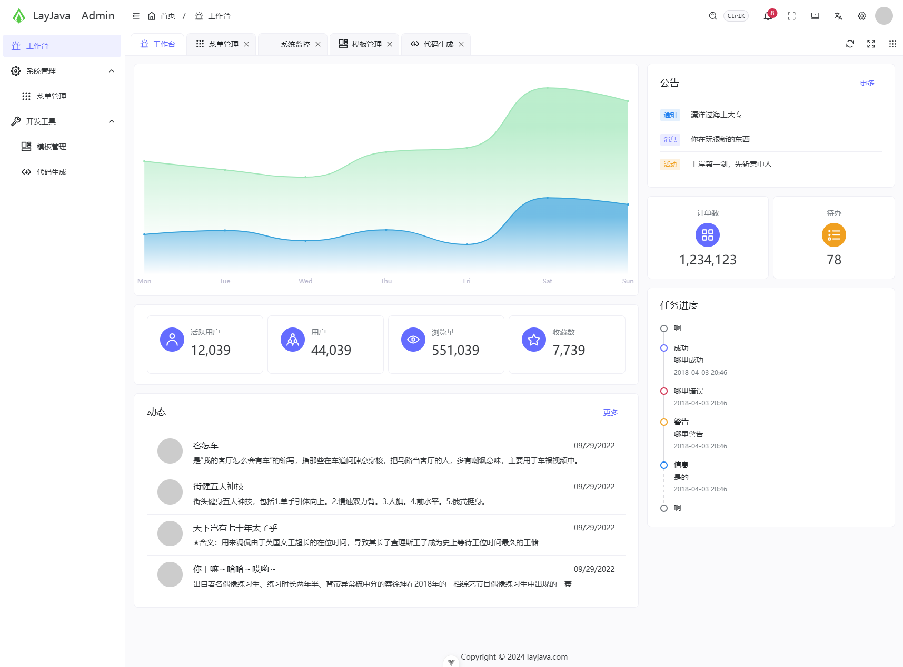
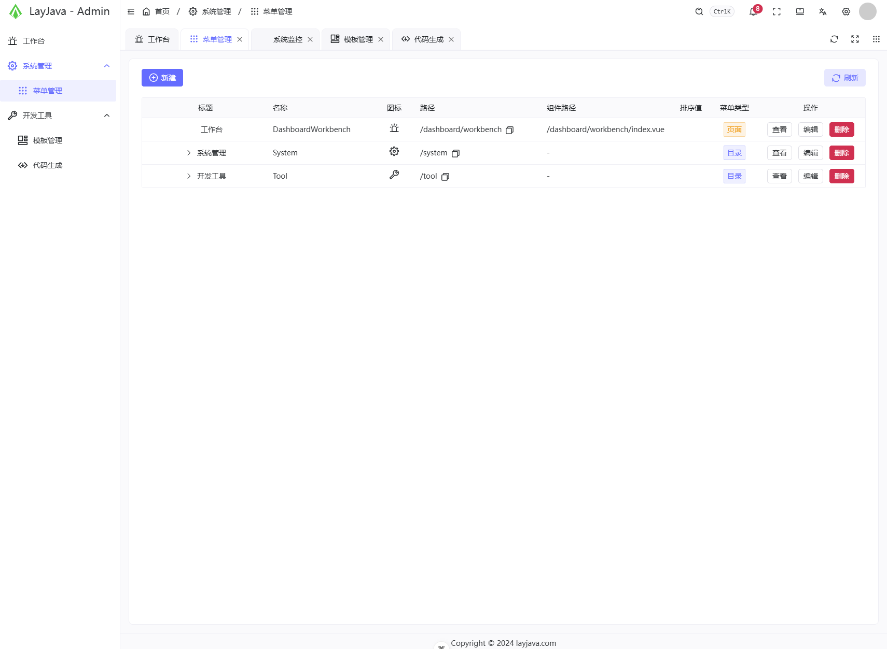
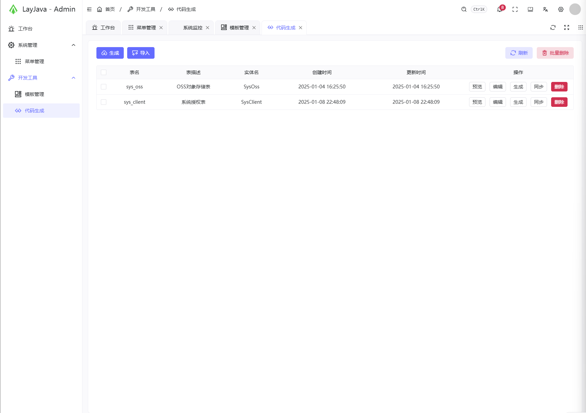
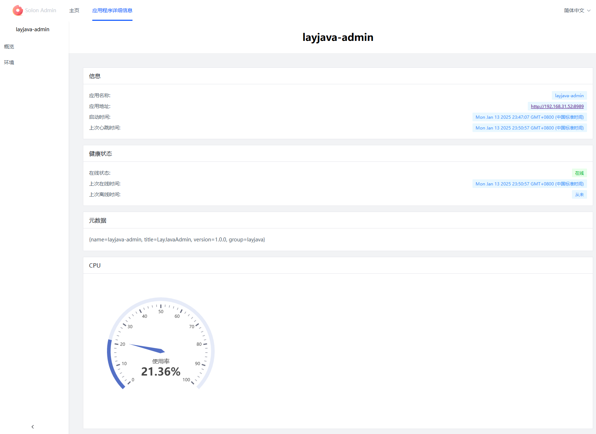

# jimuqu-admin

 

#### 介绍
jimuqu-admin 是基于solon的管理系统，

> 项目代码、文档 均开源免费可商用 遵循开源协议在项目中保留开源协议文件即可 
活到老写到老 为兴趣而开源 为学习而开源 为让大家真正可以学到技术而开源

> 文档地址: [https://doc.jimuqu.com](https://doc.jimuqu.com)

> 演示系统: [https://admin.jimuqu.com](https://admin.jimuqu.com)

## 功能列表

| 业务     | 功能说明                                                                 |
|--------|----------------------------------------------------------------------|
| 客户端管理  | 系统内对接的所有客户端管理 如: pc端、小程序端等 支持动态授权登录方式 如: 短信登录、密码登录等 支持动态控制token时效 |
| 用户管理   | 用户的管理配置 如:新增用户、分配用户所属部门、角色、岗位等                                       |
| 部门管理   | 配置系统组织机构（公司、部门、小组） 树结构展现支持数据权限                                       |
| 岗位管理   | 配置系统用户所属担任职务                                                         |
| 菜单管理   | 配置系统菜单、操作权限、按钮权限标识等                                                  |
| 角色管理   | 角色菜单权限分配、设置角色按机构进行数据范围权限划分                                           |
| 字典管理   | 对系统中经常使用的一些较为固定的数据进行维护                                               |
| 参数管理   | 对系统动态配置常用参数                                                          |
| 通知公告   | 系统通知公告信息发布维护                                                         |
| 操作日志   | 系统正常操作日志记录和查询 系统异常信息日志记录和查询                                          |
| 登录日志   | 系统登录日志记录查询包含登录异常                                                     |
| 文件管理   | 系统文件展示、上传、下载、删除等管理                                                   |
| 文件配置管理 | 系统文件上传、下载所需要的配置信息动态添加、修改、删除等管理                                       |
| 在线用户管理 | 已登录系统的在线用户信息监控与强制踢出操作                                                |
| 定时任务   | 运行报表、任务管理(添加、修改、删除)、日志管理、执行器管理等                                      |
| 代码生成   | 多数据源前后端代码的生成（java、html、xml、sql）支持CRUD下载                              |
| 系统接口   | 根据业务代码自动生成相关的api接口文档                                                 |

## 系统预览图

